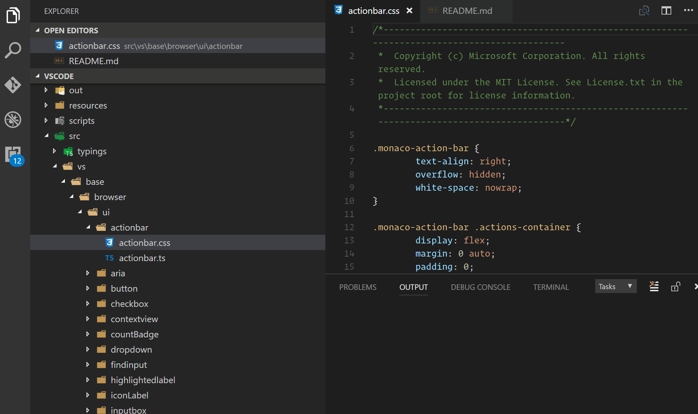

# Auto-Collapse Explorer

## Summary
Each time the active editor changes, this extension makes sure the file tree on the left is collapsed and focuses on the currently active file. In addition with the visual highlight of the active file, this helps the eye see where in the folder hierarchy the active file is.

## How to Use:
Install the extension and things will work! As you change documents you'll notice that all directories are collapsed except the one that contains the file you are currently editing. However, to get the best experience, make sure that the built-in auto-reveal setting is false or you will notice flickering each time you change files. This is because VS Code will reveal the file, then this extension will collapse the explorer and re-reveal the file. 

`"explorer.autoReveal": false`;

 And to disable the auto-collapse provided by this extension, add this to your settings:

`"explorer.autoCollapse": false`

If you'd like to be able to toggle this with a keyboard command, I recommend using [Settings Cycler](https://marketplace.visualstudio.com/items?itemName=hoovercj.vscode-settings-cycler).

## Known Issues
If the sidebar is closed, changing files will open it again. There is no way yet to get the sidebar status.

## Inspiration:
In [this question](https://stackoverflow.com/questions/42673828/how-to-collapse-explorer-folders-before-focusing-a-file-in-vcode), a stackoverflow user asked if it was possible to automatically collapse folders while switching between documents. To my knowledge, this is not possible without an extension, so I created one.

## Apis Used:
* [window.onDidChangeActiveTextEditor](https://code.visualstudio.com/docs/extensionAPI/vscode-api#_window) - An event that is triggered when the active text editor changes
* [commands.executeCommand](https://code.visualstudio.com/docs/extensionAPI/vscode-api#_commands) - A function that allows executing built in commands or commands that are provided by the extension. In this case, I execute:
  * `workbench.files.action.collapseExplorerFolders` to collapse the folders
  * `workbench.files.action.showActiveFileInExplorer` to re-focus on the active file in the tree view which expands only the necessary directories
  * `workbench.action.focusActiveEditorGroup` to put the cursor focus back in the file that was opened

## See More

This is a part of the my API Playground repository. Each subdirectory is a self-contained extension that demonstrates a particular API, repros a bug, answers a stackoverflow question, etc.

## Release Notes

### 0.0.2
* Changed name to "Auto-Collapse Explorer"
* ADDED: `explorer.autoCollapse` configuration option.

### 0.0.1

Initial release that collapses and then focuses the active file each time the active editor changes.