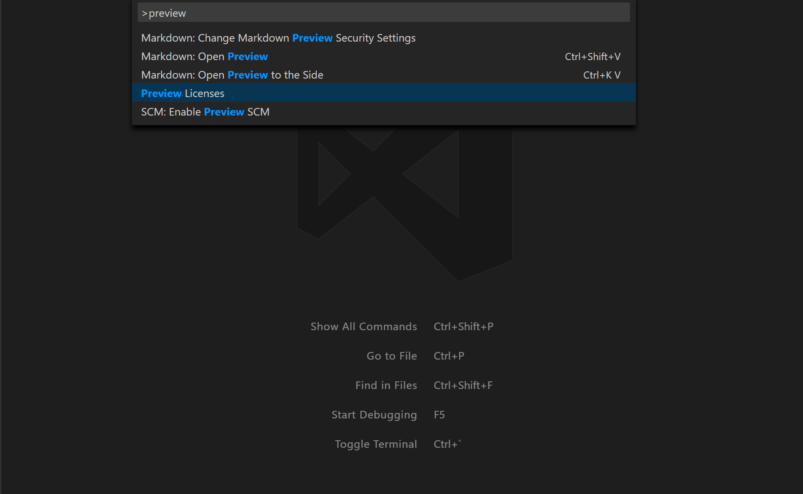

# QuickPickDocumentPreview - License Previewer

## Summary
An extension that demonstrates how to set up a TextDocumentContentProvider to display content based on the current selection in a QuickPick. The content shown is backed by files bundled with the extension, but they are shown as read-only virtual documents. This is useful for bundling example code or documentation with an extension that users should be able to read but not modify.

## Inspiration:
A gitter user asked if it was possible to react to quickpick changes. After they opened [this issue](https://github.com/Microsoft/vscode/issues/22334) on github, I realized that there was an api hook so I made this extension to demonstrate it.

## How to Use:
Simply install the extension and trigger "Preview Licenses" from the command palette.

## Apis Used:
* [QuickPick](https://code.visualstudio.com/docs/extensionAPI/vscode-api#QuickPickOptions): Gives the user a drop down list of choices. It also takes a function that will be triggered as the user cycles through the list.
* [TextDocumentContentProvider](): Gives extensions the ability to provide virtual documents. These are documents that don't actually exist on disk, like the HTML preview of a markdown file. For this extension, it is used to provide a readonly/preview look at license files bundled with the extension.

## See More

This is a part of the my API Playground repository. Each subdirectory is a self-contained extension that demonstrates a particular API, repros a bug, answers a stackoverflow question, etc.

## Acknowledgements

License files sourced from [here](https://github.com/IQAndreas/markdown-licenses).

## Release Notes

### 0.0.1

Initial release that allows live preview of license.md files while cycling through a QuickPick. 