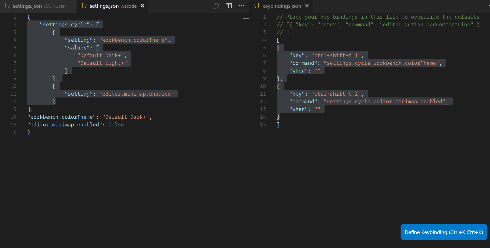

# Settings Cycler

## Summary
Sometimes VS Code ships a new feature without a toggle command (`editor.minimap.enabled`, `explorer.autoReveal`). Sometimes you want to easily toggle between a light and dark themes. Maybe you want to do something even more complex and toggle multiple settings at once.

This extension allows configuring commands to cycle through settings. At its simplest, this allows toggling things such as the minimap and statusbar visibility. At it's most complex, it allows cycling through lists of complex object values.

([See below](#how-to-use)) for how to use it.

__Note:__ The configuration schema has changed in v1.0.0. I'm sorry for the breaking change.



## How to Use:

There are two ways to configure commands. Directly in the keybindings file using the `settings.cycle` command with args, or by adding `settings.cycle` to user or workspace settings.

By default, the extension will only modify user settings unless the `overrideWorkspaceSettings` option is set to true for a group. When true, it will still default to user settings unless there is already a workspace setting in place that it can override, in which case ALL of the specified settings will be set in workspace settings.

Note: I've used booleans and strings for the settings in the examples below, but any javascript object can be assigned.

### Option 1: Keybindings.json only

If you like to keep your settings files small, you can use keybindings.json to pass the settings directly to the `settings.cycle` command as args as shown below:

```json
{
	"key": "F4",
	"command": "toggle",
	"when": "editorTextFocus",
	"args": {
		"id": "zen", // must be unique
        "overrideWorkspaceSettings": true,
		"values": [ // Note: use the same settings in each values object
			{
				"editor.minimap.enabled": true,
				"workbench.statusBar.visible": true
			},
			{
				"editor.minimap.enabled": false,
				"workbench.statusBar.visible": false
			}
		]
	}
}
```

### Option 2: User settings + Keybindings.json

#### Step 1: Add a configuration for the setting

```json
    "settings.cycle": [
        {
            "id": "colorTheme", // must be unique
            "overrideWorkspaceSettings": false,
            "values": [
                {
                    "workbench.colorTheme": "Default Dark+"
                },
                {
                    "workbench.colorTheme": "Default Light+"
                }
            ]
        }
    ],
```

#### Step 2: Configure a keyboard shortcut

Each `id` will generate a command that looks like `settings.cycle.<id>`. So to configure a keybinding to toggle between the values set for `colorTheme`, add something like this to `keybindings.json`.

```json
{
    "key": "ctrl+shift+t",
    "command": "settings.cycle.colorTheme",
}
```

## Issues

If there are issues, set `"settings.cycle.logLevel": "log"`, copy the output, and [submit an issue](https://www.github.com/hoovercj/vscode-api-playground/new).

## Inspiration:
A gitter user asked if it was possible to toggle `explorer.autoReveal` via a keyboard shortcut. It isn't, but I realized how general this problem was. Then @rebornix from the VS Code team chimed in and showed how this idea could be further expanded to work for multiple settings at once and be declared directly in the keybindings. Read his blog post about it [here](https://medium.com/hack-visual-studio-code/toggle-any-setting-in-vs-code-using-keyboard-shortcut-arguments-cdb5ddc56955).

## See More

This is a part of the my [API Playground repository](https://www.github.com/hoovercj/vscode-api-playground). Each subdirectory is a self-contained extension that demonstrates a particular API, repros a bug, answers a stackoverflow question, etc.

## Apis Used:
* [Commands](https://code.visualstudio.com/docs/extensionAPI/vscode-api#_commands) - The commands API provides a way to add commands which can be triggered from the command palette or via key bindings. As demonstrated in this extension, they can be generated dynamically at runtime to create rich, semantic commands, or a single command can be used by passing different args to it.
* [Configuration](https://code.visualstudio.com/docs/extensionAPI/vscode-api#WorkspaceConfiguration) - The configuration API handles user and workspace settings for vscode. It allows extensions to react to configuration changes, to read configuration settings, and to write to them.

## Acknowledgements
* v1.0.0 schema changes and idea for using command args come from @rebornix and his [toggle](https://github.com/rebornix/vscode-toggle) extension.

## Release Notes

### 1.0.0
* Changed `settings.cycle` configuration schema
* Added `settings.cycle` command which takes the new schema as args
* Can now cycle multiple settings at once
* Can now add arguments directly to the keybindings

### 0.0.2
* Fixed README icon

### 0.0.1
Initial release
* Added `settings.cycle` configuration
* Generate `settings.cycle.<setting name>` commands