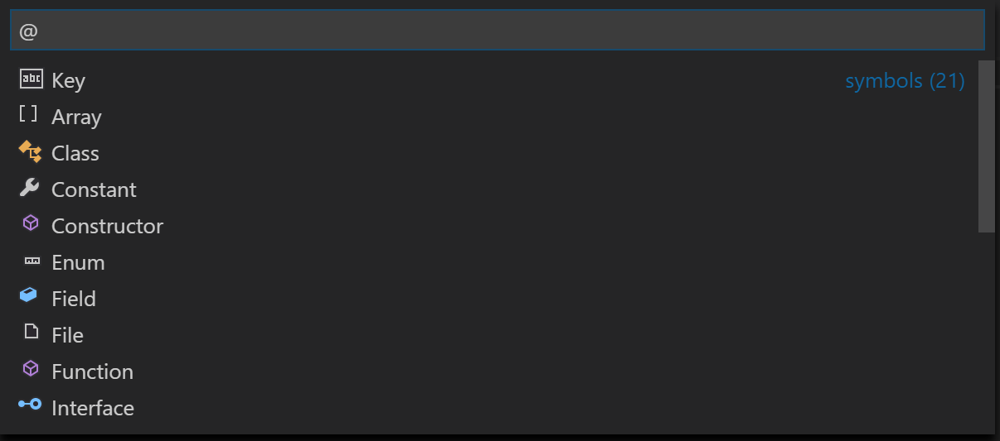

# Symbol Icons

## Summary
This extension implements the DocumentSymbolProvider interface to make it easy to preview the icons each of the symbol kinds in the vscode api (e.g. field, property, method, class, etc.).

## Inspiration:
I noticed that fields and properties were using the same icon in the document symbols list but not in the intellisense/autocomplete list. I found the root cause, opened a [github issue](https://github.com/Microsoft/vscode/issues/21315), and used this extension to verify my fix.

## How to Use:
Open a file named "icons.ts" and press `ctrl+shift+O` on a Windows machine or use the `Go to Symbol in File...` command to see a list of symbols.

## Apis Used:
* [DocumentSymbolProvider](https://code.visualstudio.com/docs/extensionAPI/vscode-api#_a-namedocumentsymbolprovideraspan-classcodeitem-id590documentsymbolproviderspan) - Provides symbol list and navigation to symbols within a document

## See More

This is a part of the my API Playground repository. Each subdirectory is a self-contained extension that demonstrates a particular API, repros a bug, answers a stackoverflow question, etc.

## Release Notes

### 0.0.1

Initial release with a document symbol provider that shows each icon.