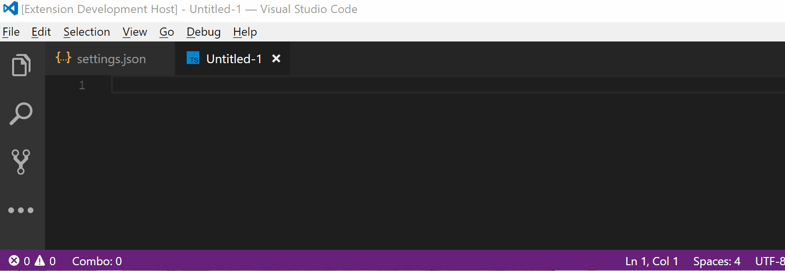

# vscode-powermode README

This is an extension based on the [Code in the Dark editor's](http://codeinthedark.com/editor/) "Power Mode" and similar extensions from [this list](https://github.com/codeinthedark/awesome-power-mode),

This is a work in progress but it supports the following features:
* A combo counter
* A timer that shows how long until your combo expires
* Awful explosion gif and screen shake effect when power mode is reached
* Configuration for:
   - Combo timeout
   - The powermode combo threshold
   - Choose your own base64 encoded gif

Up next:
* Instead of gifs, add option to cycle through background colors for a "cleaner" look
* Add multiple gifs to improve the visual variety of explosions
* Get BETTER gifs